# Spacery frontend

Сслыка на фронт - localhost:8080/

### Бронирование
* просмотр бронирований (по статусам)

* бронь на сегодня/завтра/любую дату

* выбор времени на кастомный промежуток времени

* карта бронирований по зонам (показать фильтрацию)

* создание брони

* успешное:

* неудачное:

* Просмотр деталей брони и QR

* за 5 минут до брони открывается пропуск в коворкинг: QR-код

* если попробовать посмотреть QR-код сильно раньше:

#### Система тикетов
* создание тикета
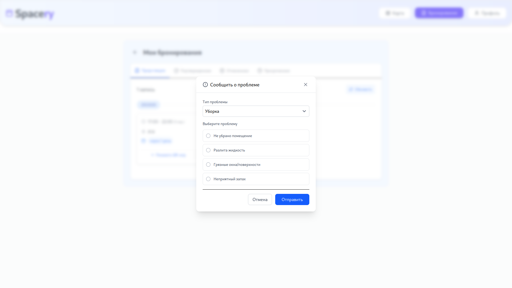
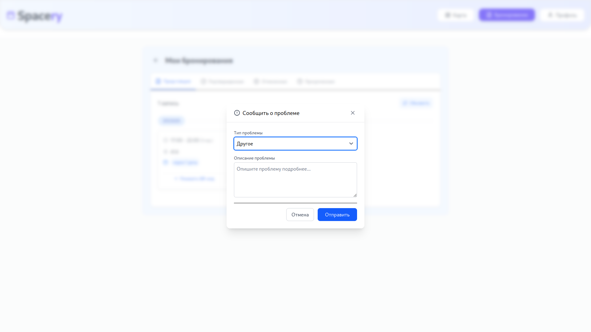
#### Профиль
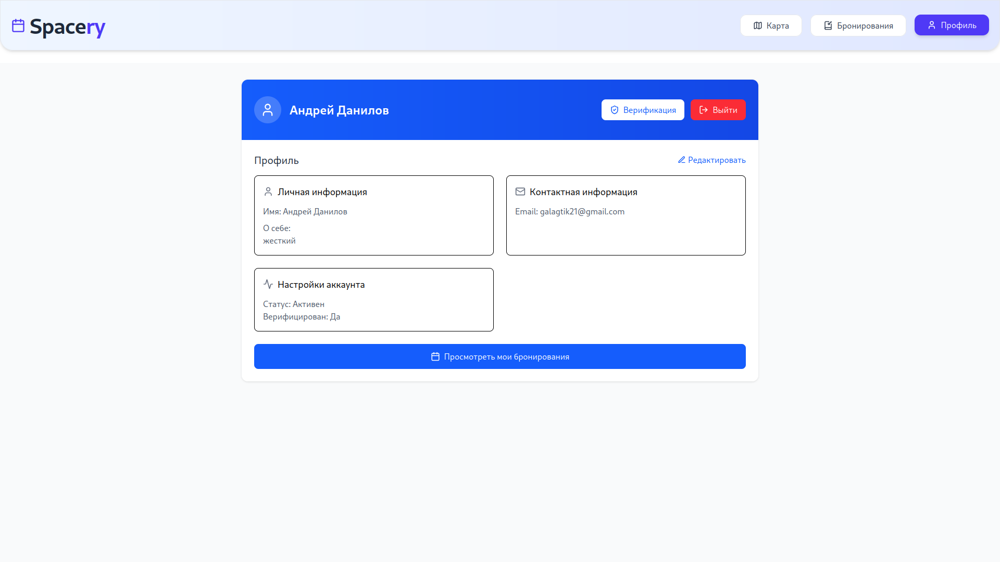

* редактирование профиля
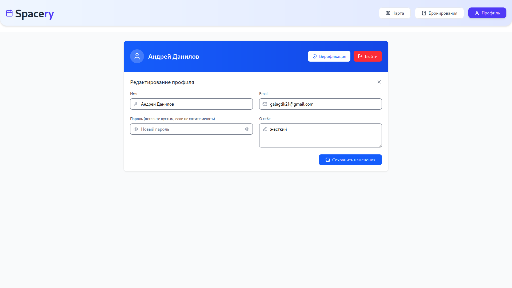

### Админ
* управление пользователями (блок/ редактирование/удаление). Просмотр бронирований на карте и возможность видеть загруженность мест по времени на карте
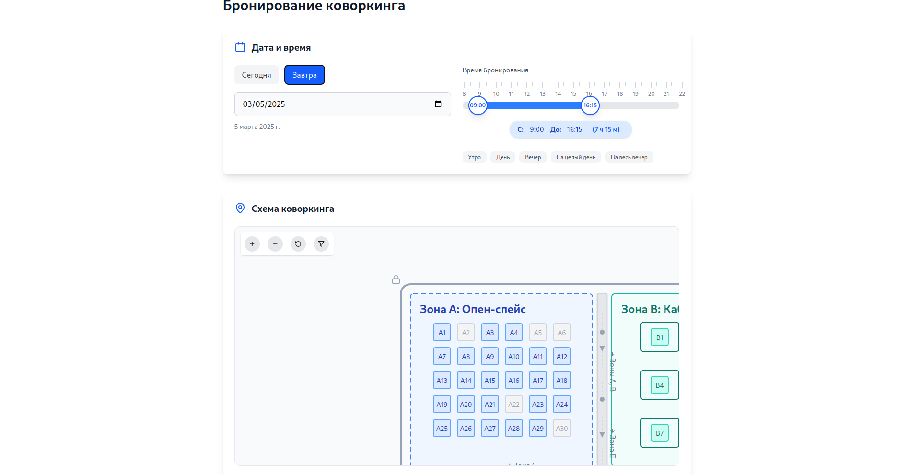
* Просмотр броней по месту
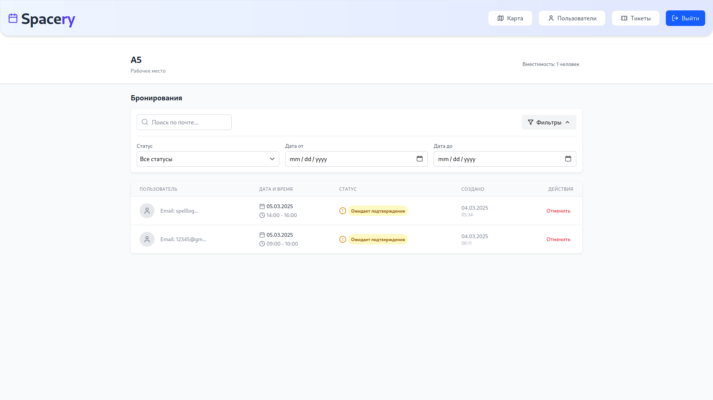

#### Управвление пользователями
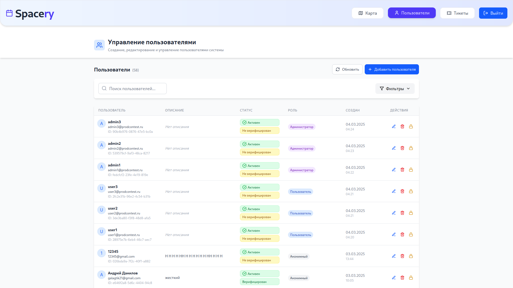

* Добавление пользователя
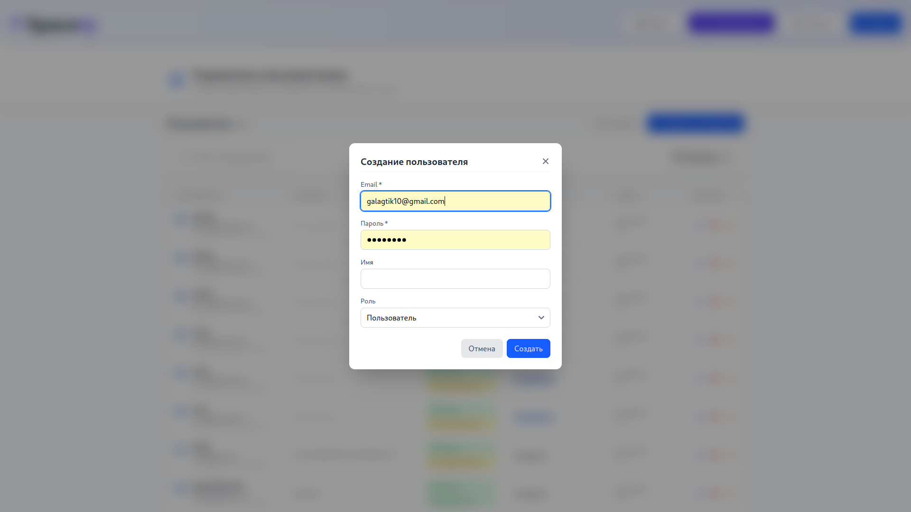
* Редактирование пользователя
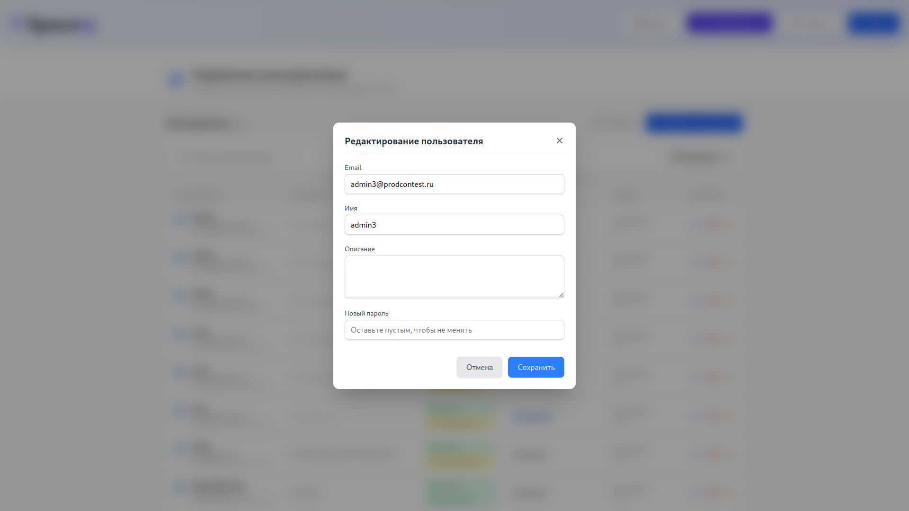
* Удаление пользователя
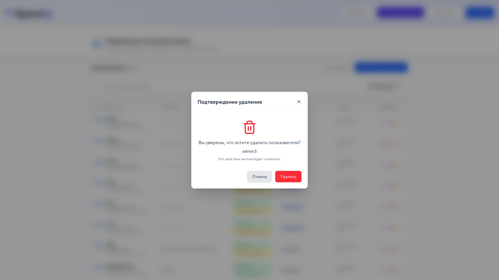

#### Управление и просмотр тикетов
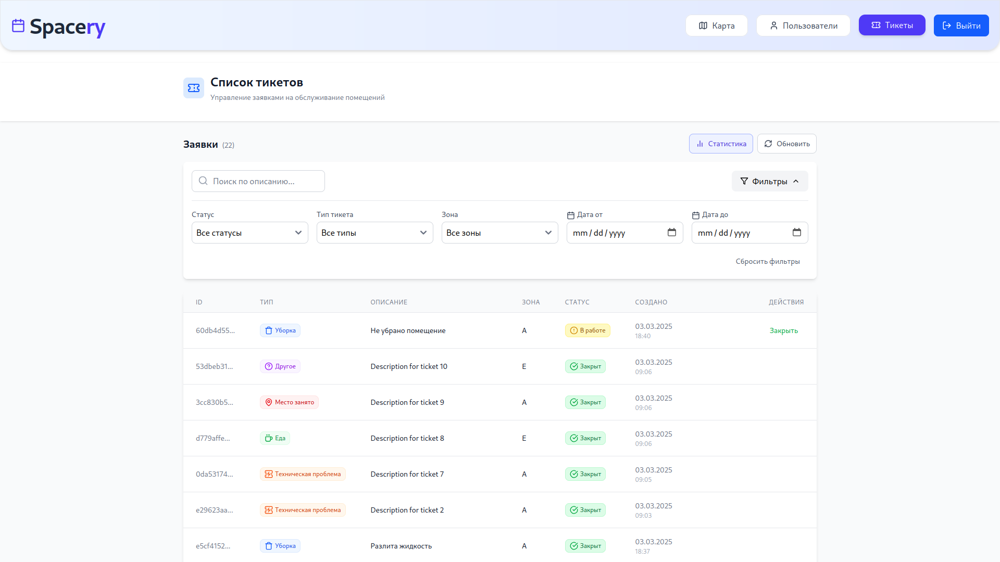

* Статистика по тикетам
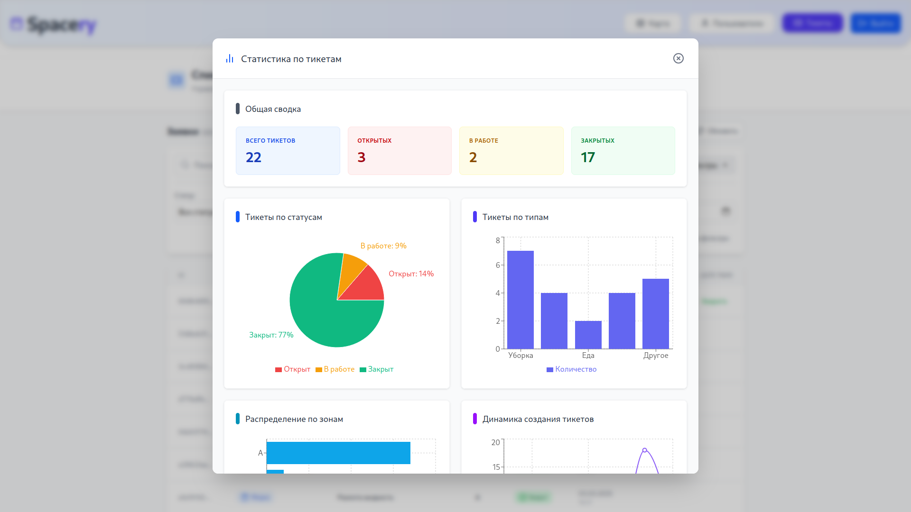
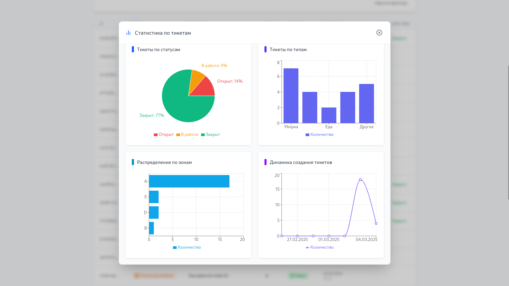

#### Подтверждение брони
* Админ сканирует qr-code и подтверждает бронь
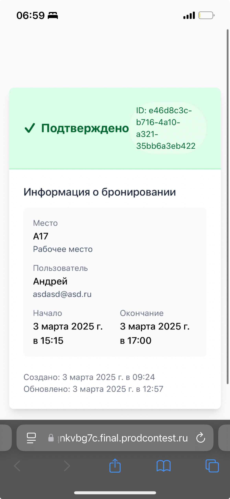